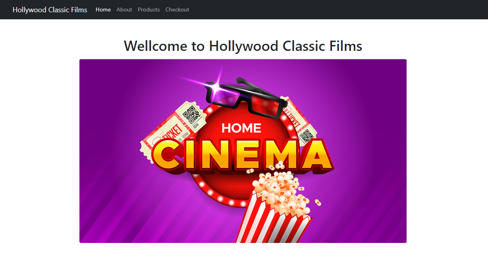

<div align="center" id="top"> 
  

  &#xa0;

</div>

<h1 align="center">Ref_MovieClassicFilms - Project</h1>

<p align="center">
  

  

  

  

  <!--  -->

  <!--  -->

  <!--  -->
</p>

<!-- Status -->

<!-- <h4 align="center"> 
	🚧  Real Time Bus Tracker 🚀 Under construction...  🚧
</h4> 

<hr> -->

<p align="center">
  <a href="#dart-about">About</a> &#xa0; | &#xa0; 
  <a href="#sparkles-features">Features</a> &#xa0; | &#xa0;
  <a href="#rocket-technologies">Technologies</a> &#xa0; | &#xa0;
  <a href="#white_check_mark-requirements">Requirements</a> &#xa0; | &#xa0;
  <a href="#checkered_flag-starting">Starting</a> &#xa0; | &#xa0;
  <a href="#memo-license">License</a> &#xa0; | &#xa0;
  <a href="#recycle-improvements">Improvements</a> &#xa0; | &#xa0;	
  <a href="https://github.com/bayardorivas" target="_blank">Author</a>
</p>

<br>

## :dart: About ##

**"Ref_MovieClassicFilms"** is a refactor project from an assigment of "Professional Certificate in Coding: Full Stack Development with MERN". This project is the implementation of **routing** using vanilla Javascript. 

Using this routing solution we can handle all pages in efficient way. The **Checkout** section is just for ilustration and it's not possible to handle payments.

## :sparkles: Features ##

:heavy_check_mark: Ref_MovieClassicFilms still in progres but uses a nice routing solution create in class using javascript.

## :rocket: Technologies ##

The following tools were used in this project:

- Vanilla Javascript
- HTML
- CSS
- [Babel](https://babeljs.io/)
- Bootstrap

## :white_check_mark: Requirements ##

Before starting : you need to have [Git](https://git-scm.com) and [Node](https://nodejs.org/en/) installed to clone de the project, and run a local web server (you can user Live Server of Visual Studio Code).

## :checkered_flag: Starting ##

```bash
# Clone this project
$ git clone https://github.com/bayardorivas/Ref_MovieClassicFilms

# Access
$ cd Ref_MovieClassicFilms

# Just Open the index.html file on your browser
```
## :recycle: Improvements ##

It would be nice the next improvements:
- [ ] Create this project using React.
- [ ] Add preview of movies.

## :memo: License ##

This project is under license from MIT. For more details, see the [LICENSE](LICENSE.md) file.

Made with :heart: by <a href="https://github.com/bayardorivas" target="_blank">Bayardo Rivas</a>

&#xa0;

<a href="#top">Back to top</a>
